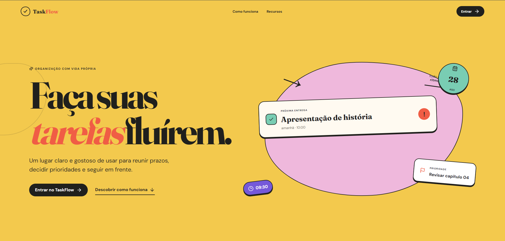
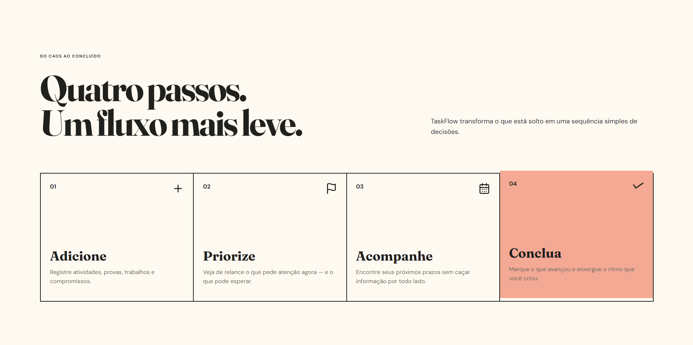
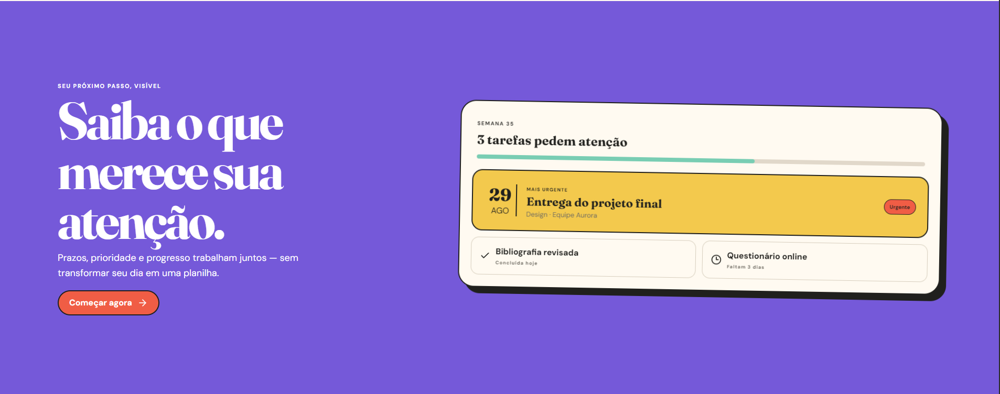
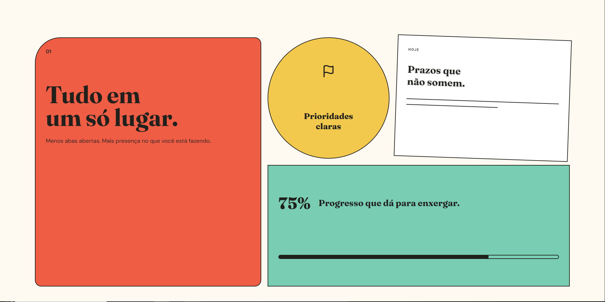
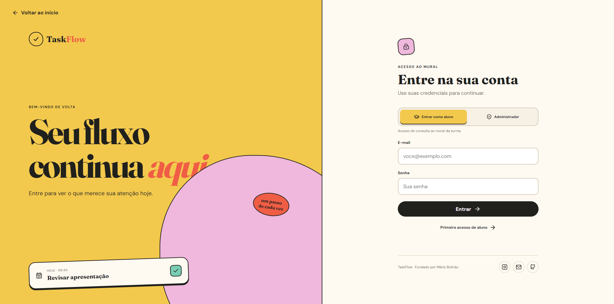
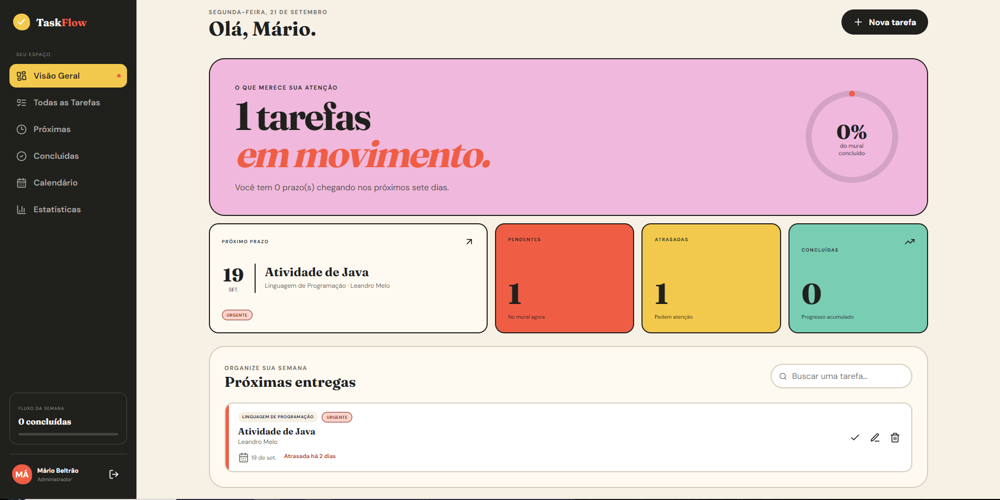
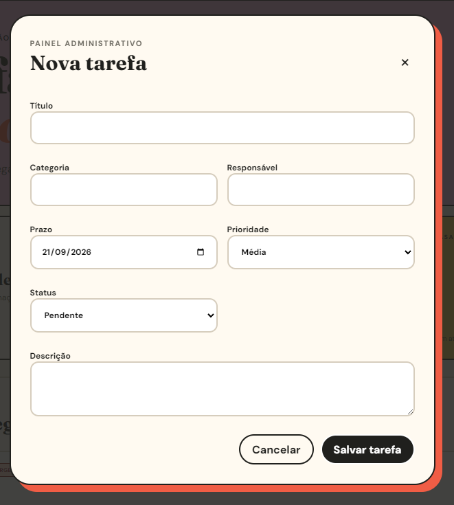
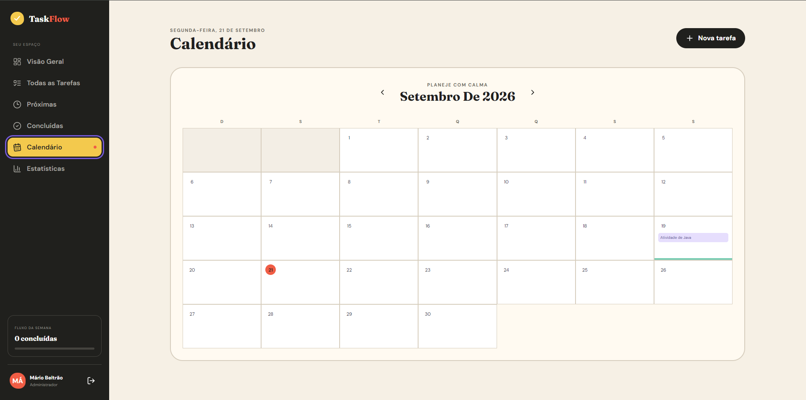

<div align="center">


# TaskFlow

### Faça suas tarefas fluírem.

**Um mural acadêmico full stack para organizar tarefas, prazos, prioridades e progresso em um único lugar.**

<br>


<br>

`React + TypeScript` • `FastAPI` • `SQLAlchemy` • `PostgreSQL` • `Alembic` • `Docker`

</div>

---

## ✨ Sobre o projeto

O **TaskFlow** nasceu para resolver um problema simples: atividades acadêmicas costumam ficar espalhadas entre mensagens, anotações, calendários e plataformas diferentes.

A proposta é transformar esse caos em um **mural único e visual**, onde uma turma consegue acompanhar o que precisa ser feito, o que está atrasado, o que vem a seguir e o que já foi concluído.

O projeto começou como uma aplicação simples em Python executada pelo terminal e evoluiu para um **MVP full stack**, com frontend React, API REST, autenticação, autorização por papéis, banco relacional, migrations, testes automatizados e ambiente de produção com Docker e PostgreSQL.

> **Objetivo central:** deixar claro o que merece atenção agora, sem transformar a rotina acadêmica em uma planilha complicada.

---

## 🎨 Identidade visual

O TaskFlow utiliza uma linguagem visual própria baseada em formas editoriais, alto contraste e cores marcantes.

| Cor | Uso |
|---|---|
| `#f3c94d` | amarelo principal |
| `#20201d` | tinta / textos e áreas escuras |
| `#f05d45` | coral para destaque e urgência |
| tons de rosa, roxo e verde | apoio visual, progresso e hierarquia |

A interface combina tipografia editorial com componentes simples e funcionais para criar uma experiência mais próxima de um **mural acadêmico vivo** do que de um sistema corporativo tradicional.

---

# 🖼️ Interface

### Landing page



A landing apresenta a proposta do projeto de forma visual e direta: **tarefas, prazos e prioridades fluindo em um único ambiente**.

<br>



O fluxo é resumido em quatro etapas:

**Adicione → Priorize → Acompanhe → Conclua**

<br>



<br>



---

### Autenticação



O acesso possui dois contextos de uso:

- **Aluno / MEMBER:** consulta o mural da turma.
- **Administrador / ADMIN:** gerencia tarefas e membros.

O cadastro de alunos não é público: o primeiro acesso depende de **convite individual** criado por um administrador.

---

### Dashboard



A visão geral concentra as informações mais importantes:

- tarefas pendentes;
- tarefas atrasadas;
- próximas entregas;
- quantidade concluída;
- progresso geral;
- busca rápida;
- prioridade;
- responsável;
- prazo.

---

### Criação e edição de tarefas



Cada tarefa pode conter:

- título;
- categoria;
- responsável;
- prazo;
- prioridade;
- status;
- descrição.

As operações de criação, edição, conclusão e exclusão são restritas ao perfil **ADMIN**.

---

### Calendário



O calendário mensal organiza as tarefas visualmente pela data de entrega, permitindo enxergar a distribuição dos prazos ao longo do mês.

---

# 🚀 Funcionalidades

| Recurso | Status |
|---|:---:|
| Landing page pública | ✅ |
| Login e logout | ✅ |
| Sessão JWT em cookie HttpOnly | ✅ |
| Papéis `ADMIN` e `MEMBER` | ✅ |
| Cadastro de aluno por convite | ✅ |
| CRUD de tarefas | ✅ |
| Prioridades | ✅ |
| Status pendente/concluído | ✅ |
| Categorias | ✅ |
| Responsável/professor | ✅ |
| Busca de tarefas | ✅ |
| Próximas entregas | ✅ |
| Tarefas atrasadas | ✅ |
| Dashboard | ✅ |
| Estatísticas | ✅ |
| Calendário mensal | ✅ |
| PostgreSQL em produção | ✅ |
| Docker | ✅ |
| Migrations com Alembic | ✅ |
| Testes frontend | ✅ |
| Testes backend | ✅ |
| Testes E2E | ✅ |
| Integração Google Calendar/Classroom | 🧪 Experimental |

---

# 👥 Perfis de acesso

O TaskFlow utiliza **controle de acesso baseado em papéis**.

### 🛡️ ADMIN

Pode:

- criar tarefas;
- editar tarefas;
- excluir tarefas;
- concluir ou reabrir tarefas;
- gerar convites para novos membros;
- visualizar todo o mural, calendário e estatísticas.

### 🎓 MEMBER

Pode:

- visualizar tarefas;
- consultar o dashboard;
- utilizar busca;
- visualizar próximas entregas;
- visualizar concluídas;
- utilizar calendário;
- consultar estatísticas.

O MEMBER é **somente leitura**.

A proteção não existe apenas visualmente: o próprio backend retorna `403 Forbidden` caso um MEMBER tente executar operações administrativas diretamente pela API.

---

# 🧠 Regras de negócio

### Próximas tarefas

São tarefas:

```text
status = PENDING
prazo >= hoje
prazo <= hoje + 7 dias
```

### Tarefas atrasadas

São tarefas:

```text
status = PENDING
prazo < hoje
```

### Ordenação do mural

O backend prioriza aproximadamente:

```text
Pendentes
   ↓
Atrasadas
   ↓
Prazo mais próximo
   ↓
Maior prioridade
   ↓
Data de criação
```

Assim, o mural tende a mostrar primeiro aquilo que realmente merece atenção.

---

# 🏗️ Arquitetura

Em produção, o TaskFlow utiliza arquitetura **same-origin**.

```text
                        INTERNET
                           │
                           ▼
                 ┌─────────────────┐
                 │     FastAPI     │
                 │   Web Service   │
                 └────────┬────────┘
                          │
             ┌────────────┴────────────┐
             │                         │
          /api/*                React compilado
             │                         │
             ▼                         ▼
       API / Backend                  SPA
             │
             ▼
        SQLAlchemy 2
             │
             ▼
        PostgreSQL
```

O navegador acessa **um único domínio**.

Exemplos:

```text
/                  → React
/login             → React
/first-access      → React
/app               → React
/api/tasks         → FastAPI
/api/auth/login    → FastAPI
/api/health        → FastAPI
```

Rotas frontend utilizam SPA fallback, enquanto rotas `/api/*` inexistentes continuam retornando `404` JSON.

---

# 🧰 Tecnologias

### Frontend

- **React 19**
- **TypeScript**
- **Vite**
- CSS próprio
- Lucide React
- Vitest
- Testing Library
- Playwright
- Jest Axe

### Backend

- **Python 3.11+**
- **FastAPI**
- SQLAlchemy 2
- Pydantic
- Uvicorn
- Alembic
- PyJWT
- Argon2

### Dados e infraestrutura

- SQLite para desenvolvimento/testes
- **PostgreSQL 17** para produção
- psycopg 3
- Docker
- Docker Compose
- GitHub Actions
- Render

---

# 🗄️ Modelo de dados

As principais entidades são:

```text
User
├── id
├── name
├── email
├── password_hash
├── role
└── created_at

Task
├── id
├── title
├── description
├── category
├── responsible
├── due_date
├── priority
├── status
├── source
├── created_by
├── created_at
└── updated_at

MemberInvite
├── id
├── email
├── token_hash
├── expires_at
├── used_at
└── created_by
```

O banco é controlado por **Alembic**, permitindo evoluir o schema sem depender da recriação manual das tabelas.

---

# 🔐 Segurança

O MVP já possui várias medidas de segurança aplicadas:

- senha armazenada com **Argon2**, nunca em texto puro;
- JWT armazenado exclusivamente em cookie `HttpOnly`;
- `Secure=true` obrigatório em produção;
- `SameSite=Lax`;
- proteção de rotas por papel;
- validação de origem para operações mutáveis;
- CORS restritivo;
- rate limit para autenticação;
- Content Security Policy;
- `X-Content-Type-Options: nosniff`;
- `Referrer-Policy`;
- `Permissions-Policy`;
- HSTS em produção;
- secrets somente por variáveis de ambiente;
- PostgreSQL obrigatório em produção.

Nenhum JWT é armazenado em `localStorage` ou `sessionStorage`.

---

# 🧪 Testes

O TaskFlow possui testes em diferentes níveis.

### Backend

```text
24 testes aprovados
```

Testados, entre outros:

- autenticação;
- autorização;
- CRUD;
- filtros;
- dashboard;
- convites;
- MEMBER somente leitura;
- regras de integração.

### Frontend

```text
62 testes Vitest aprovados
```

### E2E

```text
7 testes Playwright aprovados
```

Os fluxos E2E validam a aplicação em navegador real, incluindo:

- login ADMIN;
- CRUD;
- MEMBER somente leitura;
- primeiro acesso;
- logout;
- persistência de sessão;
- sessão inválida.

### Coverage

| Métrica | Cobertura |
|---|---:|
| Statements | **93,85%** |
| Branches | **89,73%** |
| Functions | **87,80%** |
| Lines | **92,03%** |

---

# 💻 Executando localmente

## Pré-requisitos

- Python **3.11+**
- Node.js **20+**
- Git

Clone o repositório:

```bash
git clone https://github.com/mariobeltrao/TaskFlow.git
cd TaskFlow
```

### Backend

No Windows PowerShell:

```powershell
python -m venv .venv
.\.venv\Scripts\Activate.ps1

python -m pip install -r backend\requirements-dev.txt

Copy-Item .env.example backend\.env

cd backend
python -m alembic upgrade head
python -m uvicorn app.main:app --reload
```

O backend ficará disponível em:

```text
http://localhost:8000
```

API docs em desenvolvimento:

```text
http://localhost:8000/docs
```

Health check:

```text
http://localhost:8000/api/health
```

### Frontend

Em outro terminal:

```powershell
cd frontend
npm ci
npm run dev
```

Acesse:

```text
http://localhost:5173
```

O Vite encaminha automaticamente `/api` para o FastAPI local.

---

# 🐳 Executando com Docker + PostgreSQL

Crie um `.env` local na raiz contendo:

```env
POSTGRES_PASSWORD=uma-senha-local-forte
SECRET_KEY=um-segredo-local-forte-com-pelo-menos-32-caracteres
```

Depois execute:

```bash
docker compose up --build
```

A aplicação completa ficará disponível em:

```text
http://localhost:8000
```

A stack executa:

```text
React
   +
FastAPI
   +
PostgreSQL
   +
Alembic
```

---

# 👑 Criando o primeiro ADMIN

Dentro de `backend/`:

```bash
python -m app.cli create-admin \
  --email admin@exemplo.com \
  --name "Administrador"
```

A senha é solicitada de forma segura e armazenada apenas como hash Argon2.

---

# 🎓 Criando um aluno

O aluno entra através de convite.

Crie o convite:

```bash
python -m app.cli create-member-invite \
  --email aluno@exemplo.com \
  --expires-days 7
```

O comando exibirá um código de uso único.

Depois o aluno acessa:

```text
/first-access
```

e informa:

```text
nome
e-mail
código do convite
senha
confirmação da senha
```

A conta criada recebe automaticamente:

```text
role = MEMBER
```

---

# ✅ Comandos de qualidade

### Backend

```bash
cd backend

python -m pytest
python -m ruff check .
```

### Frontend

```bash
cd frontend

npm test
npm run test:coverage
npm run lint
npm run build
npm run test:e2e
```

---

# 🌐 Produção

O projeto está preparado para publicação utilizando:

```text
Render Web Service
+
Render PostgreSQL
```

Em produção:

```text
Browser
   ↓ HTTPS
TaskFlow
   ↓
FastAPI + React
   ↓
PostgreSQL
```

Principais variáveis:

```env
ENVIRONMENT=production
DATABASE_URL=postgresql://...
SECRET_KEY=<segredo-forte>
COOKIE_SECURE=true
FRONTEND_URL=https://seu-dominio
CORS_ORIGINS=https://seu-dominio
ENABLE_GOOGLE_INTEGRATION=false
GOOGLE_CALENDAR_SYNC_ENABLED=false
```

O passo a passo completo está em:

[`DEPLOYMENT.md`](DEPLOYMENT.md)

---

# 🧪 Experimental

Existe uma arquitetura já desenvolvida para integração com:

- Google Calendar;
- Google Classroom / Classroom Bridge.

Essa parte está **fora do escopo atual do MVP** e permanece desativada.

```env
ENABLE_GOOGLE_INTEGRATION=false
```

O código foi preservado para evolução futura sem interferir na aplicação principal.

---

# 📂 Estrutura do projeto

```text
TaskFlow/
│
├── backend/
│   ├── alembic/
│   ├── app/
│   │   ├── api/
│   │   ├── core/
│   │   ├── db/
│   │   ├── models/
│   │   ├── repositories/
│   │   ├── schemas/
│   │   ├── security/
│   │   └── services/
│   └── tests/
│
├── frontend/
│   ├── public/
│   ├── e2e/
│   └── src/
│       ├── components/
│       ├── pages/
│       ├── services/
│       ├── test/
│       ├── types/
│       └── utils/
│
├── docs/
│   └── images/
│
├── docker/
├── .github/
│   └── workflows/
│
├── compose.yaml
├── Dockerfile
├── DEPLOYMENT.md
└── README.md
```

---

# 📈 Evolução do projeto

```text
Versão inicial
│
├── Python
├── terminal
└── tarefas em memória

        ↓

MVP Full Stack
│
├── React + TypeScript
├── FastAPI
├── API REST
├── autenticação
├── autorização
├── SQLAlchemy
├── migrations
└── testes

        ↓

Public Alpha
│
├── PostgreSQL
├── Docker
├── same-origin
├── segurança de produção
├── CI
└── deploy
```

---

# 🔭 Próximos passos

O foco atual é manter o núcleo simples e confiável.

Possíveis evoluções futuras:

- painel administrativo de alunos;
- disciplinas como entidade própria;
- suporte a múltiplas turmas;
- notificações;
- backups automatizados;
- domínio próprio;
- integração Google Calendar/Classroom;
- rate limit distribuído;
- workers e scheduler dedicados.

---

# ❤️ Autor

<div align="center">

### Mário Beltrão

Estudante de Ciência da Computação • Desenvolvedor Full Stack

[](https://github.com/mariobeltrao)
[](https://www.instagram.com/mariobeltraoo_/)

<br>

**TaskFlow — Faça suas tarefas fluírem.**

</div>
